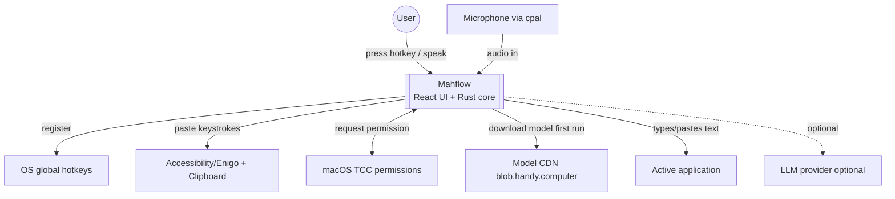
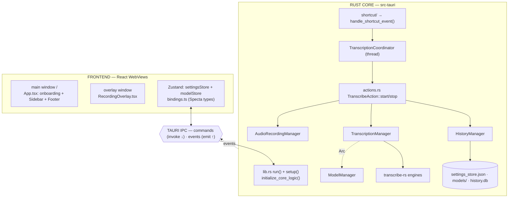
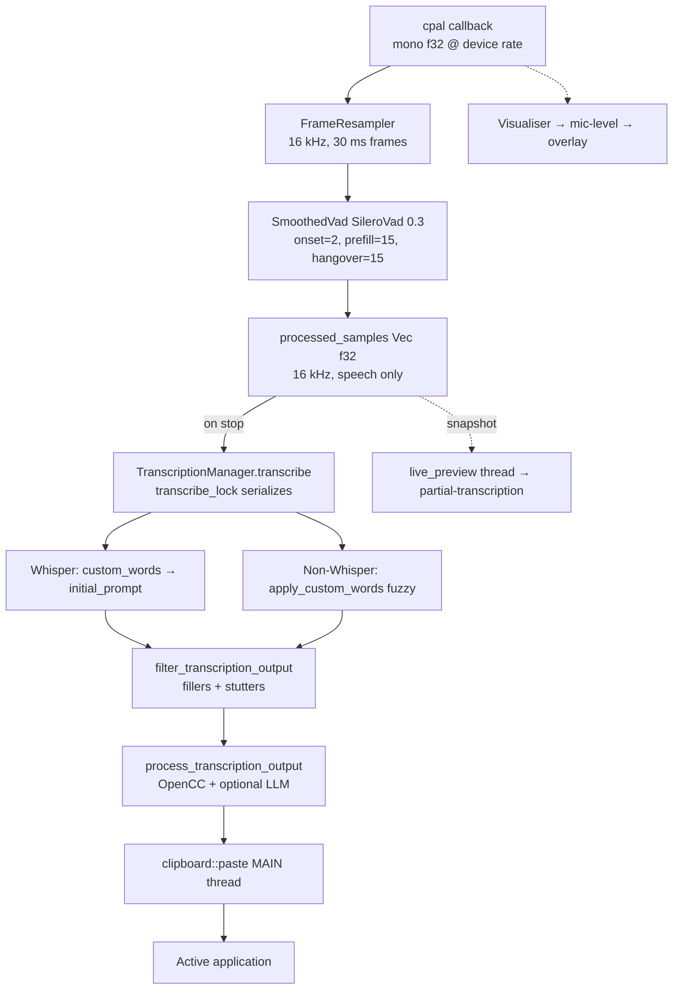
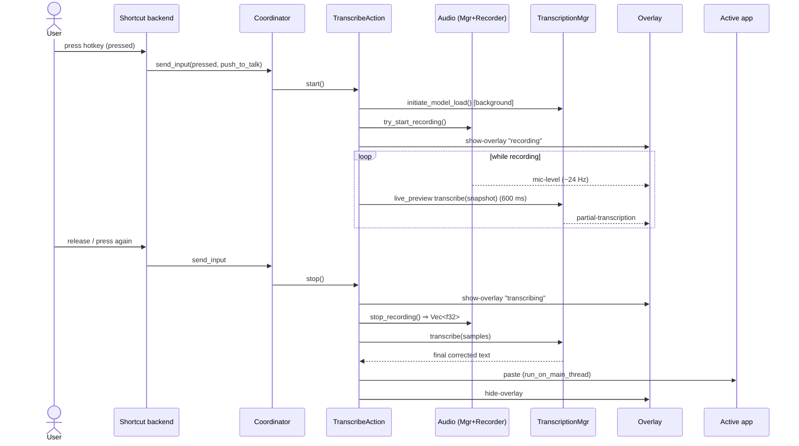

# Mahflow — Architecture Deep Dive

> A guided, professor-style tour of the whole codebase: what each part is, what it
> does, and which functions call which. Read this alongside the editable diagrams in
> [`mahflow-architecture.drawio`](./mahflow-architecture.drawio) (open it in Cursor —
> the draw.io viewer renders all 5 pages). The Mermaid diagrams below render directly
> in Markdown preview if you don't want to open the `.drawio`.

---

## 0. The one-sentence mental model

> **Mahflow is a push-to-talk dictation app: you hold a hotkey, it records your voice,
> a local speech model turns it into text, and it pastes that text into whatever app
> you're using — all offline.**

Everything else in this document is detail hanging off that sentence.

### Tech stack (and *why* each piece exists)

| Layer | Technology | Why it's here |
|---|---|---|
| UI | **React + TypeScript** (Vite) | Familiar, fast to build settings screens |
| Desktop shell | **Tauri** (Rust) | Tiny binaries, native OS access, uses the OS webview instead of bundling Chromium |
| Core logic | **Rust** | Real-time audio + ML inference need speed and threads; Rust gives both safely |
| Speech-to-text | **`transcribe-rs`** engines (Whisper, Parakeet, …) | Runs models locally → privacy + no network latency |
| Voice detection | **Silero VAD** (ONNX) | Cheaply decides "is this speech?" so we don't transcribe silence |
| IPC | **Tauri commands + events** | Typed bridge between the JS UI and Rust core |

**Analogy:** Think of a restaurant. The **React UI** is the dining room (what the
customer sees). **Tauri IPC** is the waiter carrying orders back and forth. The
**Rust core** is the kitchen. The **managers** are specialized stations (grill,
prep, pantry, dishwashing). The **coordinator** is the head chef making sure two
orders don't collide on the same station.

---

## 1. Context — what Mahflow talks to

*(Page 1 of the `.drawio`.)*

**Teaching point — privacy by architecture.** Notice the only outbound network arrows
are *model download* (once) and an *optional* LLM. The actual transcription never
leaves your machine. That's a deliberate design property, not an accident: the speech
model is loaded into the Rust process and run locally.

---

## 2. System & components — the big boxes

*(Page 2 of the `.drawio`.)*

### 2.1 Startup, step by step (`main.rs` → `lib.rs`)

1. **`src-tauri/src/main.rs`** parses CLI args (`clap`) and calls
   `mahflow_app_lib::run(cli_args)`.
2. **`lib.rs run()`** (~line 326):
   - `portable::init()` — detect "portable mode" (settings/data stored next to the app).
   - Builds a **Specta** command registry via `collect_commands![...]` — this is how
     Rust functions become callable from JS *and* how `src/bindings.ts` is generated.
   - Registers Tauri **plugins** (store, global-shortcut, clipboard, updater, dialog,
     macos-permissions, nspanel for the macOS overlay, …).
   - `.setup(...)` closure runs once the app is ready.
3. **`.setup()`** (lines 527–606):
   - Creates the **main window** in Rust (the `tauri.conf.json` window list is empty —
     all windows are created programmatically). It starts **hidden**.
   - `app.manage(TranscriptionCoordinator::new(...))` — see §4.
   - Calls **`initialize_core_logic()`**.
4. **`initialize_core_logic()`** (lines 149–304) constructs the four managers and
   `.manage()`s them so any command/thread can later fetch them with
   `app.state::<Arc<Manager>>()`:
   - `AudioRecordingManager`, `ModelManager`, `TranscriptionManager` (gets an `Arc`
     clone of `ModelManager`), `HistoryManager`.
   - Builds the **system tray** and the **recording overlay** window.

> **Concept — Tauri "managed state."** `app.manage(x)` puts `x` into a typed registry.
> Later, `app.state::<T>()` fetches it. This is **dependency injection**: instead of
> passing managers through dozens of function signatures, any handler grabs what it
> needs by type. The managers are wrapped in `Arc<…>` so multiple threads can share
> one instance safely.

### 2.2 The four managers (the "stations")

| Manager | File | Owns | One-line job |
|---|---|---|---|
| `AudioRecordingManager` | `managers/audio.rs` | recorder, VAD, mic mode | Capture mic → speech-only `Vec<f32>` |
| `TranscriptionManager` | `managers/transcription.rs` | loaded ASR engine, locks | Load model + run `transcribe()` |
| `ModelManager` | `managers/model.rs` | catalog, download flags | Download/verify/extract models |
| `HistoryManager` | `managers/history.rs` | SQLite + WAVs | Persist past transcriptions |

Each holds its mutable state behind `Arc<Mutex<…>>` or atomics (so it's
thread-safe), and reads user settings through `settings::get_settings(app)` rather
than caching them.

### 2.3 The Tauri IPC bridge (`src/bindings.ts`)

`bindings.ts` is **generated by tauri-specta — never edit it by hand.** It gives the
frontend a typed `commands` object and an `events` object:

- `commands.changePttSetting(true)` (camelCase TS) → invokes the Rust handler
  `change_ptt_setting` (snake_case). Most return `Promise<Result<T, string>>`.
- `events.historyUpdatePayload.listen(cb)` wraps `listen("history-update-payload", cb)`.

There are **100+ commands**, grouped by domain: `shortcut::*` (settings + rebinding),
`commands::models::*` (download/select), `commands::audio::*` (devices), `commands::history::*`,
and a handful of top-level ones (`initialize_enigo`, `initialize_shortcuts`, `cancel_operation`).

---

## 3. The core pipeline — audio → text → paste

*(Page 3 of the `.drawio`.)* This is the heart of the app.

### 3.1 Capture (`audio_toolkit/audio/recorder.rs`)

- `AudioRecorder::open()` spawns a **worker thread**. Inside it, **cpal** (cross-platform
  audio library) delivers raw samples on the OS audio callback thread.
- Those samples flow over an **mpsc channel** (`AudioChunk::Samples(Vec<f32>)`) to a
  **consumer loop** (`run_consumer`) so the real-time audio callback is never blocked.
- The consumer does three things per chunk:
  1. **Visualiser** → 16 FFT bands → `level_cb` → emits the `mic-level` event (the bars
     in the overlay).
  2. **`FrameResampler`** converts the device sample rate to a fixed **16 kHz** in
     **30 ms frames (480 samples)** — the rate the models and VAD expect.
  3. **`handle_frame`** runs VAD when `recording == true`.

> **Concept — why a separate consumer thread + channel?** The OS audio callback has a
> hard real-time deadline (a few milliseconds). If you do FFTs and ML there, you get
> audio glitches. The classic fix is the **producer/consumer** pattern: the callback
> only *produces* (push samples to a queue) and a different thread *consumes* (does the
> heavy work). The `mpsc` channel is the queue.

### 3.2 Voice Activity Detection (`audio_toolkit/vad/`)

- **`SileroVad`** (`silero.rs`) takes one 480-sample frame and returns a speech
  probability; `prob > 0.3` ⇒ `Speech`, else `Noise`.
- **`SmoothedVad`** (`smoothed.rs`) wraps it to avoid choppy cutoffs:
  - **onset = 2**: require 2 voiced frames before declaring speech (ignores a single click).
  - **prefill = 15**: keep ~450 ms before speech started, so the first word isn't clipped.
  - **hangover = 15**: keep emitting ~450 ms after speech stops, so trailing words survive.
- Result: `processed_samples` contains *speech only*. Whisper never sees your silence.

> **Important nuance you hit earlier:** VAD answers "*is someone* speaking?" — **not**
> "is *you* speaking?" That's why background YouTube/meeting audio still got
> transcribed; the cure is OS-level **Voice Isolation**, not VAD tuning.

### 3.3 Transcription (`managers/transcription.rs`)

- `transcribe()` first takes the **`transcribe_lock`** (`Arc<Mutex<()>>`) so only one
  transcription (final *or* live-preview) runs at a time on the single loaded engine.
- If a model is mid-load, it waits on an `is_loading` flag + `Condvar`.
- It **takes the engine out** of its `Mutex<Option<…>>` for the duration of inference
  (so the lock isn't held during the slow part), runs it inside `catch_unwind` (a model
  panic shouldn't crash the app), then puts it back.

### 3.4 Custom words — the dual path (`audio_toolkit/text.rs`)

This is the subtle bit that fixed your "Indian names" problem:

- **Whisper:** your `custom_words` are joined with commas and passed as the
  **`initial_prompt`**, which biases the decoder *before* it guesses. No fuzzy matching.
- **Every other engine:** there's no prompt input, so **after** transcription
  `apply_custom_words()` does **fuzzy correction** — a 1–3 word sliding window compared
  to your custom words using **Levenshtein** (edit distance) + **Soundex** (sounds-like),
  replacing close matches.
- **All engines** then run `filter_transcription_output()` to drop filler words ("um",
  "uh") and collapse stutters.

### 3.5 Paste (`clipboard.rs`, via Enigo)

- Runs on the **main thread** (`run_on_main_thread`) because simulating keystrokes must
  happen there on macOS.
- Branches on `PasteMethod`:
  - **Direct** → `enigo.text(text)` types it out (or Linux typing tools).
  - **CtrlV / CtrlShiftV / ShiftInsert** → save current clipboard, write your text,
    send the paste keystroke, then **restore** the old clipboard.
  - **ExternalScript** → hand the text to a user script.
- Optional auto-submit presses Enter afterward.

---

## 4. Concurrency model — how races are avoided

Three independent input sources can fire at any moment: the **shortcut thread**, **Unix
signals**, and **CLI single-instance** calls. They all funnel into one place so they
can't stomp on each other.

### 4.1 `handle_shortcut_event` → `TranscriptionCoordinator`

`shortcut/handler.rs::handle_shortcut_event(app, binding_id, hotkey, is_pressed)`:

- For `transcribe` / `transcribe_with_post_process`: it does **not** act directly —
  it sends the event to the **`TranscriptionCoordinator`** over an `mpsc` channel.
- For `cancel`: only if currently recording.

The **coordinator runs on its own thread** and owns a single `Stage` enum:
`Idle → Recording(binding) → Processing → Idle`. Because only that one thread mutates
`Stage`, there's no lock needed and no race:

- **Push-to-talk:** press in `Idle` ⇒ `start`; release in `Recording` ⇒ `stop`.
- **Toggle:** press toggles between `start` and `stop`.
- A press while `Processing` is ignored (you can't start a new recording while the last
  one is still transcribing).

A 30 ms debounce filters key-repeat noise.

> **Concept — the actor pattern.** The coordinator is essentially an *actor*: a single
> thread that owns some state and receives messages through a queue. This is a common
> way to make concurrency *correct by construction* — there's exactly one writer, so
> "two threads change Stage at once" simply cannot happen.

### 4.2 Where the work happens

`TranscribeAction::start` (`actions.rs`) is the conductor:
- kicks off `initiate_model_load()` (background), `preload_vad()` (background),
- shows the overlay, sets tray icon to *Recording*,
- starts the mic via `AudioRecordingManager::try_start_recording()`,
- starts `live_preview::start(app)`.

`TranscribeAction::stop` then runs the async tail: stop recording → get `Vec<f32>` →
(in parallel) save WAV + `transcribe()` → post-process → paste → hide overlay. A
`FinishGuard` notifies the coordinator "I'm done" on drop, returning it to `Idle`.

---

## 5. Recording sequence (time-ordered)

*(Page 4 of the `.drawio`.)*

> **Teaching point — live preview is a "preview," not the source of truth.** The loop
> re-transcribes a *snapshot* of the growing buffer every 600 ms just to show you
> something. The text that actually gets pasted comes from the **single final
> `transcribe(samples)`** call after you release the key. Both share `transcribe_lock`,
> so they never run on the engine simultaneously.

---

## 6. Frontend — state, settings, and the overlay

*(Page 5 of the `.drawio`.)*

### 6.1 Boot (`src/main.tsx` → `src/App.tsx`)

- `main.tsx` sets a platform attribute on `<html>`, initializes i18n, eagerly inits the
  **model store**, then renders `<App/>`.
- `App.tsx` runs an **onboarding state machine**: `accessibility → model → done`.
  - It checks permissions (macOS accessibility + mic) and whether any model is
    downloaded (`commands.hasAnyModelsAvailable()`).
  - Once `done`, it calls `commands.initializeEnigo()` and `commands.initializeShortcuts()`
    — note these are **deferred** until after permissions, which is exactly why the
    accessibility flow had to complete first.
- `App.tsx` also listens for backend events and shows toasts: `recording-error`,
  `paste-error`, `model-state-changed`.

### 6.2 Settings — optimistic updates (`stores/settingsStore.ts`)

`updateSetting(key, value)`:
1. mark `isUpdating[key] = true`,
2. **optimistically** merge the new value into the Zustand store (UI updates instantly),
3. call the mapped `settingUpdaters[key](value)` → the right `commands.change*Setting`,
4. on error, **roll back** to the old value.

> **Concept — optimistic UI.** Rather than wait for the Rust round-trip, the UI assumes
> success and updates immediately, reverting only if the backend rejects it. This makes
> toggles feel instant. The cost is the rollback logic you must write for the failure case.

### 6.3 Models — event-driven downloads (`stores/modelStore.ts`)

The store registers listeners for `model-download-progress`, `-complete`,
`-verification-*`, `-extraction-*`, `-failed`, `-cancelled`. The Rust `ModelManager`
emits these as it works, and the store updates progress bars / auto-selects the model
when the download finishes.

### 6.4 The overlay webview (`src/overlay/RecordingOverlay.tsx`)

A *second*, tiny, transparent, always-on-top window (an NSPanel on macOS). It listens
for exactly four events and renders accordingly:

| Event | Renders |
|---|---|
| `show-overlay` (`recording`/`transcribing`/`processing`) | the matching state |
| `mic-level` (`number[]`) | smoothed VU bars |
| `partial-transcription` (`string`) | the live "lyrics-style" caption |
| `hide-overlay` | hides |

The cancel button calls `commands.cancelOperation()`.

---

## 7. Supporting subsystems

- **Shortcuts (`shortcut/`)** — two interchangeable backends: Tauri's
  `global-shortcut` plugin (default on Linux) and **`mahflow-keys`** (default on
  macOS/Windows). Both end at the same `handle_shortcut_event`. Rebinding from the UI
  uses `suspend_binding`/`resume_binding` + `change_binding`. The `cancel` shortcut is
  registered *only while recording*.
- **Tray (`tray.rs`)** — three icon states (Idle/Recording/Transcribing) and a menu
  (settings, copy last transcript, model submenu, unload model, cancel, quit). State is
  driven from `actions.rs`, not from the shortcut handler.
- **Overlay window (`overlay.rs`)** — created at boot but hidden; the `OVERLAY_ENABLED`
  atomic suppresses the ~24 Hz `mic-level` emissions when the overlay is off, to save CPU.
- **Settings (`settings.rs`)** — one big `AppSettings` struct persisted as JSON via
  `tauri-plugin-store` (`settings_store.json`), read on every access through
  `get_settings(app)`.
- **History (`managers/history.rs`)** — SQLite `history.db` plus WAV files in
  `recordings/`, with retention cleanup; emits `history-update-payload` so the History
  screen updates live.

---

## 8. Where to look first (a reading order for a newcomer)

1. `src-tauri/src/lib.rs` — `run()` and `initialize_core_logic()` (the wiring).
2. `src-tauri/src/actions.rs` — `TranscribeAction::start` / `stop` (the conductor).
3. `src-tauri/src/managers/audio.rs` + `audio_toolkit/audio/recorder.rs` (capture).
4. `src-tauri/src/managers/transcription.rs` + `audio_toolkit/text.rs` (text).
5. `src-tauri/src/transcription_coordinator.rs` (the concurrency guardrail).
6. `src/App.tsx` + `src/stores/settingsStore.ts` (the frontend).

---

## 9. Key takeaways

- **Three input sources, one funnel.** All triggers go through `handle_shortcut_event`
  → `TranscriptionCoordinator`, which serializes everything via a single-thread `Stage`.
- **Real-time audio is decoupled** from heavy work via a producer/consumer mpsc channel.
- **VAD trims silence**, not background voices.
- **Custom words take two routes**: Whisper `initial_prompt` vs. fuzzy post-correction.
- **The UI is optimistic**; the Rust core is the source of truth and pushes events back.
- **Two webviews**: the main settings window and a tiny always-on-top overlay.

## 10. Common mistakes when reading this code

1. Assuming the **live-preview** text is what gets pasted — it isn't.
2. Expecting `apply_custom_words` to run for **Whisper** — Whisper uses `initial_prompt`.
3. Confusing `mahflow_keys::start_recording` (UI key-capture for rebinding) with
   *voice* recording.
4. Looking for windows in `tauri.conf.json` — they're created in Rust.

## 11. Review questions

1. Why does `TranscribeAction::stop` call `live_preview::stop()` *before*
   `stop_recording()`?
2. What guarantees that two key presses in quick succession can't start two recordings?
3. Why must `clipboard::paste` run on the main thread, and what would break otherwise?
4. Why is the `cancel` shortcut registered only during recording instead of at startup?

## 12. Practical exercise

Trace, in order, **every thread spawned and every lock acquired** when a user in
**push-to-talk** mode holds the transcribe key for 3 seconds with **live preview on**
and a **Parakeet** model selected. Start at the key-down event and end at the pasted
text. (Hint: shortcut thread → coordinator thread → `TranscribeAction` async task →
recorder worker thread → live-preview thread, and the `transcribe_lock`/engine
`Mutex`/`RecordingState` mutex interactions between them.)
